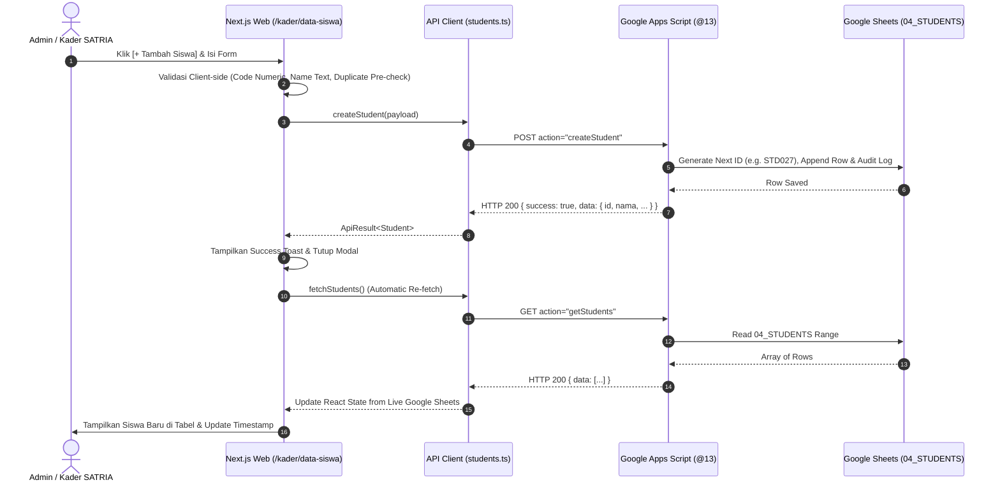

# SANTARA STUDENT MANAGEMENT IMPLEMENTATION
**Dokumentasi Implementasi Modul Manajemen Data Siswa & Sinkronisasi Google Sheets**
*Sistem Pemantauan Kesehatan Remaja SMA (SANTARA)*  
*Route Frontend: `/kader/data-siswa`*  
*Waktu Selesai: 2026-08-10T18:46:46+07:00*

---

## 1. Arsitektur Alur Data & Sinkronisasi

---

## 2. Fitur-Fitur Utama yang Diimplementasikan

### A. Form Input & Validasi Siswa Baru (Modal Dialog)
1. **Nomor / Kode Siswa (`student_code`)**:
   - Wajib diisi (*Required*).
   - Wajib murni numerik (*Numeric Only* via regex `/^\d+$/`). Karakter huruf dan simbol langsung ditolak.
   - Pengecekan pra-duplikasi (*Pre-Duplicate Check*) secara real-time pada kelas/sekolah yang sama.
2. **Nama Lengkap Siswa (`nama`)**:
   - Wajib diisi (*Required*).
   - Murni teks alfabetis (*Alphabetical Text Only*). Input angka-saja seperti `"12345"` ditolak.
   - Minimal 2 karakter.
3. **Dropdown Sekolah & Kelas**:
   - Terhubung dinamis ke master sekolah (`02_SCHOOLS`) dan master kelas (`03_CLASSES`).
   - Otomatis membatasi opsi kelas yang valid untuk sekolah yang dipilih.
4. **Jenis Kelamin & Tanggal Lahir**:
   - Pilihan `P` (Perempuan - Sasaran TTD) dan `L` (Laki-laki).
   - Input tanggal standar `YYYY-MM-DD` untuk kalkulasi otomatis usia pada kartu JAKRA.

### B. Sinkronisasi Real-Time & Single Source of Truth
- **Auto Re-fetch**: Setelah penambahan siswa berhasil, sistem langsung memanggil `fetchStudents()` untuk mengambil snapshot terbaru langsung dari Google Sheets.
- **Tombol Manual Refresh**: Dilengkapi tombol `[ ↻ Refresh Data ]` dengan animasi loading dan timestamp akurat (`"Data diperbarui pada HH:mm:ss"`).
- **Background Auto-Sync**: Sinkronisasi pasif berjalan setiap 60 detik tanpa memblokir interaksi pengguna dan dibersihkan saat komponen unmount.

### C. Ringkasan Metrik & Kartu Jejak Kesehatan Remaja (JAKRA)
- Kartu statistik: **Total Siswa**, **Siswa Aktif**, **Remaja Putri (Sasaran TTD)**, dan **Remaja Putra**.
- Fitur pencarian instan berdasarkan Nama, Nomor Siswa, atau ID.
- Filter multi-kriteria (Kelas, Gender, Status Kesiswaan).
- Modal interaktif **Kartu Digital JAKRA** untuk melihat profil lengkap siswa, nomor induk, sekolah, dan usia terhitung.
